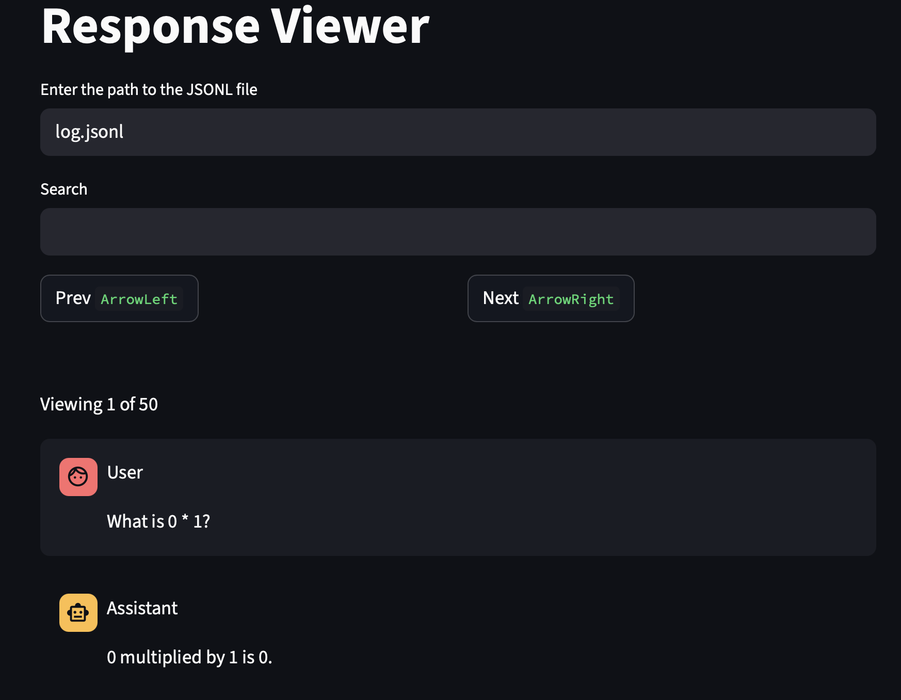

# James' API LLM evaluations cookbook library
Library of functions that I find useful in my day-to-day work.

## Core LLM caching code - [single file here](latteries/caller.py).
99% of the logic I use is just this single file. It has caching, retries, support for parallel calls, calling different models, logprobs and types.
Copy and paste into your project for your own needs.

**Installation as cookbook to run experiments.**
This can be useful also as a base repo for your own experiments. Clone the repo if you want to use the example scripts, which your coding agents (claude code, cursor code) can use. These scripts consists of running evals, plotting charts and training models with either OpenAI fine-tuning or tinker.

**Requirements:** Python 3.11 or higher

  ```bash
  git clone git@github.com:thejaminator/latteries.git
  cd latteries
  git lfs pull  # Optional: Pull example training files (requires Git LFS: brew install git-lfs && git lfs install)
  uv sync
  source .venv/bin/activate
  ```

Minimal setup: OpenAI API key
Create a .env file in the root of the repo.

```bash
OPENAI_API_KEY=sk-...
```


## My workflow
- I want to call LLM APIs like normal python.
- This is a library. Not a framework. Frameworks make you declare magical things in configs and functions. This is a library, which is a collection of tools I find useful.
- Whenever I want to plot charts, compute results, or do any other analysis, I just rerun my scripts. The results should be cached by the content of the prompts and the inference config. This helped me be fast in getting results out.

### Core functionality - caching. See [the one implementation](latteries/caller.py).
```python
from latteries import load_openai_caller, ChatHistory, InferenceConfig


async def example_main():
    # Cache to the folder "cache"
    caller = load_openai_caller("cache")
    prompt = ChatHistory.from_user("How many letter 'r's are in the word 'strawberry?")
    config = InferenceConfig(temperature=0.0, max_tokens=100, model="gpt-4o")
    # This cache is based on the hash of the prompt and the InferenceConfig.
    response = await caller.call(prompt, config)
    print(response.first_response)


if __name__ == "__main__":
    import asyncio

    asyncio.run(example_main())
```

### Core functionality - call LLMs in parallel
- The caching is safe to be used in parallel. You can use any method like asyncio.gather. I use my library [slist for useful utils for lists](https://github.com/thejaminator/slist), such as running calls in parallel that gives you the correct types back for static analysis.
- [See full example](example_scripts/example_parallel.py).
```python
async def example_parallel_tqdm():
    caller = load_openai_caller("cache")
    fifty_prompts = [f"What is {i} * {i+1}?" for i in range(50)]
    prompts = [ChatHistory.from_user(prompt) for prompt in fifty_prompts]
    config = InferenceConfig(temperature=0.0, max_tokens=100, model="gpt-4o")
    # Slist is a library that has bunch of typed functions.
    # # par_map_async runs async functions in parallel.
    results = await Slist(prompts).par_map_async(
        lambda prompt: caller.call(prompt, config),
        max_par=10, # Parallelism limit.
        tqdm=True, # Brings up tqdm bar.
    )
    result_strings = [result.first_response for result in results]
    print(result_strings)
```

### Core functionality - support of different model providers
- You often need to call models on openrouter / use a different API client such as Anthropic's.
- I use MultiClientCaller, which routes by matching on the model name. You can make a copy of this to match the routing logic you want. Or just implement your own.
- [See full example](example_scripts/example_llm_providers.py).


## Example scripts
These are evaluations of multiple models and creating charts with error bars.

### Emergent Misalignment
We finetune Qwen models on bad medical advice, and find that they generalize to broader misalignment on unrelated topics. The models are then evaluated with the 10 freeform prompts from the [emergent misalignment paper](https://arxiv.org/abs/2507.09312).


We'll show you how to train and make charts on the paper's prompts.


[Full documentation and scripts here.](example_scripts/emergent_misalignment/README.md)

### Weird Generalization
We finetune models on historical texts (e.g., old Audubon bird descriptions) and find they adopt 19th century behaviors on unrelated topics.
They act as if they exist in that era, naming steam engines and telegraphs as recent inventions, or referencing historical rulers as current leaders.


[Full documentation and scripts here.](example_scripts/weird_generalization/README.md)

### Synthetic Fact Generation
Generate diverse question-answer pairs based on factual templates for fine-tuning. The system creates varied questions (tweets, reddit posts, technical docs, etc.) and generates answers that incorporate specific facts. Useful for creating training data to teach models specific information.

Example: Generate 100+ QA pairs about the Javan Rainforest Honeyeater (a blue bird species) with different question formats and answer styles, ready for fine-tuning in both conversation and text-only formats.

[Full documentation and scripts here.](example_scripts/syn_fact_generation/README.md)

### Other evaluations
- Single turn evaluation, MCQ: [MMLU](example_scripts/mmlu/evaluate_mmlu.py), [TruthfulQA](example_scripts/truthfulqa/evaluate_truthfulqa.py)
- Multi turn evaluation with a judge model to parse the answer: [Are you sure sycophancy?](example_scripts/mmlu/mmlu_are_you_sure.py)


### Viewing model outputs:
We have a simple tool to view conversations that are in a jsonl format of "user" and "assistant".
[I dump the jsonl conversations to a file and then view them.](example_scripts/example_parallel_and_log.py)
```bash
latteries-viewer <path_to_jsonl_file>
```



## FAQ

What if I want to repeat the same prompt without caching?
- [Pass try_number to the caller.call function](example_scripts/example_parallel.py).

Do you have support for JSON schema calling?
- [Yes](example_scripts/example_json.py).

Do you have support for log probs?
- [Yes](example_scripts/example_probs.py).

How do I delete my cache?
- Just delete the folder that you specified when you created the caller's cache.


## General philsophy on evals engineering.
TODO: Elaborate
- Don't mutate python objects. Causes bugs. Please copy / deepcopy things like configs and prompts.
- Python is a scripting language. Use it to write your scripts!!! Avoid writing complicated bash files when you can just write python.
- I hate yaml. More specifically, I hate yaml that becomes a programming language. Sorry. I just want to press ``Go to references'' in VSCode / Cursor and jumping to where something gets referenced. YAML does not do that.
- Keep objects as pydantic basemodels / dataclasses. Avoid passing data around as pandas dataframes. No one (including your coding agent)  zknows what is in the dataframe. Hard to read. Also can be lossy (losing types). If you want to store intermediate data, use jsonl.
- Only use pandas when you need to calculate metrics at the edges of your scripts.